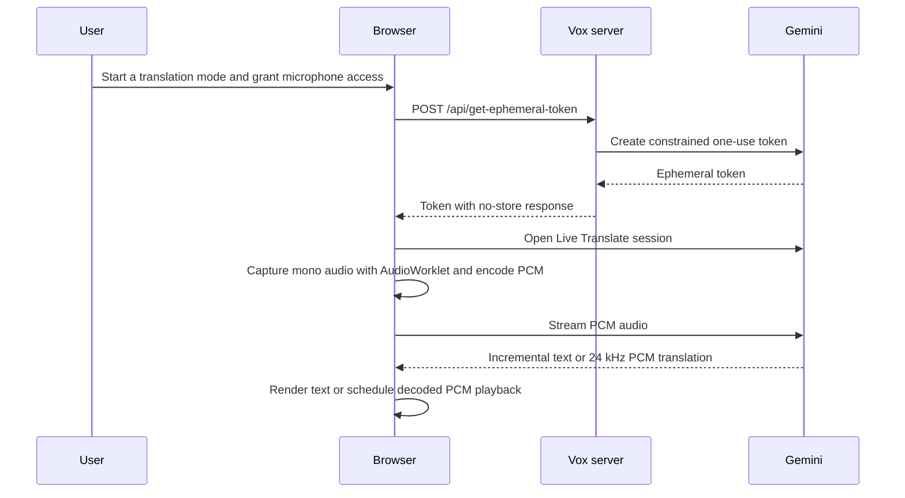

# Vox architecture

Technical details for Vox Live Translate. See the [README](../README.md#architecture) for the architecture overview and system diagram. Paths below are relative to the repository root.

## Application layers

| Area                           | Location                                                                                                                     | Responsibilities                                                                                                                                                                |
| ------------------------------ | ---------------------------------------------------------------------------------------------------------------------------- | ------------------------------------------------------------------------------------------------------------------------------------------------------------------------------- |
| Application shell and routing  | `src/routes/__root.tsx`, `src/routes/`, `src/start.ts`                                                                       | Registers the service worker, renders TanStack file routes, and enforces authentication before protected pages and API routes execute.                                          |
| Translation experiences        | `src/routes/speech-to-text.tsx`, `src/routes/speech-to-speech.tsx`, `src/routes/conversation.tsx`, `src/routes/recorder.tsx` | Own page-level state, acquire the microphone, create Gemini sessions, render translations, and release browser resources when a mode stops or unmounts.                         |
| Shared live-translation client | `src/lib/liveTranslation.ts`                                                                                                 | Requests an ephemeral token from the server and opens a constrained Gemini Live connection in the browser.                                                                      |
| Audio pipeline                 | `src/features/audio/`                                                                                                        | Captures mono microphone audio through an `AudioWorklet`, converts float samples to 16-bit PCM, base64-encodes PCM for Gemini, and decodes returned PCM for Web Audio playback. |
| Conversation domain            | `src/features/conversation/`                                                                                                 | Coordinates two translation streams, routes microphone data according to the active speaker, queues translated audio, and records local transcripts.                            |
| Authentication and persistence | `src/server/auth.ts`, `src/server/db/`                                                                                       | Verifies Google credentials, creates and destroys sessions, and accesses PostgreSQL through Drizzle ORM.                                                                        |
| PWA/static assets              | `public/`                                                                                                                    | Provides the manifest, service worker, icons, and Android Digital Asset Links document.                                                                                         |

## Routes and access control

`src/routes/` is the route contract. Page files provide the translation and history screens; route handlers implement authentication and API endpoints.

| Endpoint or route                                                                       | Purpose                                                                                                | Access                                            |
| --------------------------------------------------------------------------------------- | ------------------------------------------------------------------------------------------------------ | ------------------------------------------------- |
| `/login`                                                                                | Loads Google Identity Services with the configured OAuth client ID.                                    | Public                                            |
| `POST /auth-callback`                                                                   | Checks Google's CSRF token, verifies the Google ID token, upserts the user, and creates a Vox session. | Public callback                                   |
| `POST /auth/logout`                                                                     | Deletes the current server-side session and clears its cookie.                                         | Public endpoint; safely handles an absent session |
| `GET /api/auth-config`                                                                  | Returns the public Google OAuth client ID used by the login page.                                      | Public                                            |
| `GET /api/session`                                                                      | Returns the authenticated user's display name.                                                         | Authenticated                                     |
| `POST /api/get-ephemeral-token`                                                         | Mints a one-use, constrained Gemini Live token for a requested target language.                        | Authenticated                                     |
| `/`, `/speech-to-text`, `/speech-to-speech`, `/conversation`, `/recorder`, `/history/*` | Translation and transcript UI.                                                                         | Authenticated                                     |

The request middleware permits only login/callback, PWA/static resources, and the auth configuration endpoint without a session. Unauthenticated API calls receive `401`; unauthenticated page requests redirect to `/login` with the original destination in `next`.

## Authentication and trust boundaries

Google Identity Services uses redirect UX and posts the credential to `POST /auth-callback`. The server validates the Google token's audience against `GOOGLE_CLIENT_ID`, requires a verified email, and then creates a random 32-byte session token. The browser receives that token only as the `vox_session` HTTP-only, `SameSite=Lax` cookie; PostgreSQL stores a SHA-256 hash, user ID, and expiry rather than the raw token. Sessions expire after seven days.

`GEMINI_API_KEY` never reaches the browser. After the browser presents a valid Vox session, `POST /api/get-ephemeral-token` uses the server-side API key to mint a Gemini token that is limited to one use, expires after two minutes, constrains new sessions to the Live Translate model and requested target language, and is recorded with its issuing user in PostgreSQL. The browser uses that ephemeral token to connect directly to Gemini, so real-time audio does not proxy through the Vox server.

## Live translation data flow

Speech-to-text requests text responses and appends incremental output transcription. Speech-to-speech requests audio responses and schedules each returned PCM chunk after the previously scheduled chunk to avoid gaps. Both modes refresh their Live session roughly every 110 seconds, before the ephemeral token's two-minute lifetime, and ignore messages from superseded sessions.

Conversation mode normally opens two Live sessions: one translates the local speaker into the companion language and one translates the companion into the local language. A single microphone stream is routed to exactly one session at a time: it feeds the companion stream while listening, the local-speaker stream while the **I am speaking** control is held, and silence while translated playback completes. In automatic companion-language mode, the companion stream first identifies the incoming language; the app then opens the local-speaker stream using that detected language. Conversation audio is queued during push-to-talk and played after release, preventing the microphone from receiving its own translated output.

## Stored data

| Store                                               | Contents                                                                                                            | Lifetime and scope                                                                                                          |
| --------------------------------------------------- | ------------------------------------------------------------------------------------------------------------------- | --------------------------------------------------------------------------------------------------------------------------- |
| PostgreSQL `users`                                  | Google subject ID, email, name, picture, and timestamps.                                                            | Server-side account record.                                                                                                 |
| PostgreSQL `sessions`                               | Hashed session token, associated user, creation time, and expiry.                                                   | Server-side; expires after seven days or is deleted at logout.                                                              |
| PostgreSQL `issued_ephemeral_tokens`                | Gemini ephemeral token identifier, issuing user, target language, issue time, and expiry.                           | Server-side issuance record; tokens themselves are short-lived.                                                             |
| Browser `localStorage` (`vox.conversation-history`) | Conversation timestamp, selected languages, original transcriptions, and translations.                              | Per browser/device only; not associated with or synchronized to the signed-in account. Clearing browser storage removes it. |
| Browser IndexedDB (`VoxRecordingStorage`)           | Recorder metadata (ID, timestamp, target language, optional title) and text transcript payloads in separate stores. | Per browser/device only; not associated with or synchronized to the signed-in account. Clearing browser data removes it.    |

## Production topology

The generated TanStack Start/Nitro server runs in the `app` container. Compose starts PostgreSQL privately in the `db` container, runs Drizzle migrations once through `migrate` after the database health check succeeds, and starts `app` only after migration completes. The app exposes `APP_PORT` (default `5080`) on `127.0.0.1`, allowing an external Nginx instance to terminate TLS and proxy requests without directly exposing the container port. PostgreSQL persists in the named `vox-live-translate-postgres-data` volume.
